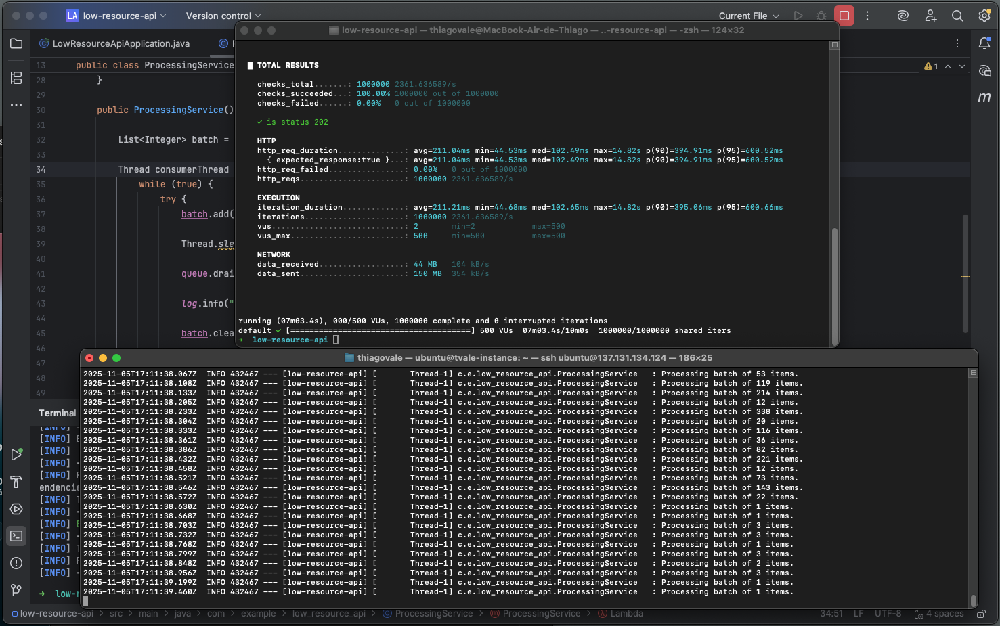

# API de Alta Performance para Baixos Recursos

Este projeto é um protótipo de uma API Java Spring construída para um desafio de arquitetura: processar **1.000.000 de requisições** no menor tempo possível em um hardware com recursos extremamente limitados (ex: 1 core de CPU e 1GB de RAM).

O objetivo deste repositório é demonstrar e permitir a validação local de um design de sistema reativo, construído para sobreviver a cenários de alta concorrência e baixo poder computacional.

---

## O Desafio: A Falha do Modelo Padrão

O Spring Boot padrão (com Spring MVC e Tomcat) falha neste cenário. O modelo **"Thread-por-Requisição"** do Tomcat tentaria alocar um *thread* para cada conexão. Em um hardware com pouca RAM, o sistema morreria por não conseguir criar novos *threads* (`java.lang.OutOfMemoryError: unable to create new native thread`) antes de atingir 1% da carga.

## A Arquitetura da Solução

Para sobreviver, a aplicação foi construída sobre quatro conceitos-chave:

### 1. I/O Não-Bloqueante (Spring WebFlux)

Em vez do Spring MVC (Tomcat), usamos o **Spring WebFlux (Netty)**. O Netty utiliza um *event loop* não-bloqueante. Isso permite que a API lide com dezenas de milhares de conexões simultâneas usando um único *thread* (ou um pequeno número de *threads*), o que é ideal para CPUs fracas.

### 2. Padrão Produtor-Consumidor (A Fila)

Separamos o "recebimento" do "processamento":
* **Produtor (O Porteiro):** O `IngestionController` (WebFlux). Sua única função é aceitar a requisição HTTP o mais rápido possível e colocá-la em uma fila.
* **Consumidor (O Trabalhador):** Um `Thread` dedicado (`ProcessingService`) que lê da fila e faz o trabalho "lento" (neste caso, logar).

Usamos uma `LinkedBlockingQueue` como a "ponte" que desacopla os dois.

### 3. Backpressure (Contrapressão)

Para evitar que a RAM exploda, a fila é **limitada** (ex: 10.000 itens). Se o "Trabalhador" (disco) for lento e a fila encher, o `queue.put()` (chamado pelo "Porteiro") irá **bloquear**. Esse bloqueio se propaga de volta ao WebFlux, que para de aceitar novas requisições HTTP.

Isso é o *backpressure*: o sistema automaticamente força o cliente (`k6`) a desacelerar para a velocidade do componente mais lento, impedindo um `OutOfMemoryError`.

### 4. Processamento em Lote (Batching) e o "Linger"

O "Trabalhador" (Consumidor) não processa 1 item de cada vez.
* **Batching:** Usamos `queue.drainTo()` para pegar um "lote" de itens da fila de uma só vez (ex: 1000 itens) e logá-los com uma única operação de disco.
* **Linger (A "Janela de Coleta"):** Para evitar *race conditions* pelo núcleo da CPU, usamos `Thread.sleep(LINGER_MS)`. Nós intencionalmente "atrasamos" o trabalhador por alguns milissegundos para dar ao Porteiro tempo de encher a fila. Este *trade-off* troca um pouco de latência por um *throughput* (vazão) de disco muito maior.

---

## Tecnologias Utilizadas

* **Java 17+**
* **Spring Boot 3+**
* **Spring WebFlux** (Reativo / Netty)
* **k6** (Ferramenta de Teste de Carga)
* **[Docker](https://docs.docker.com/engine/install/)** para simular recurso limitado em máquina

---

## Como Executar e Testar Localmente

#### Você pode testar: 
1. Standalone: rodando direto na sua máquina
2. Containers: usando docker containers simulado limitação dos recursos (requer Docker instalado)

Para validar esta arquitetura em sua máquina, você precisará de dois terminais abertos no diretório do projeto e do [k6](https://k6.io/docs/getting-started/installation/) instalado.

### 1. Testando _standalone_

#### Empacotar a Aplicação:

Primeiro, compile e empacote o projeto em um arquivo `.jar`:

```bash
./mvnw clean package
```

#### Executar (Terminal 1 - O Servidor):

No seu primeiro terminal, inicie a aplicação Java. Os logs de processamento (do "Trabalhador") aparecerão aqui.

```bash
java -jar target/low_resource_api-0.0.1-SNAPSHOT.jar
```
*O servidor iniciará e ficará aguardando na porta 8080.*

#### Testar (Terminal 2 - O Cliente):

No seu segundo terminal, você usará o `k6` para disparar 1.000.000 de requisições.

**a. Prepare o script `test.js`:**
Certifique-se que o arquivo `test.js` (incluído neste repositório) está apontando para o seu servidor local:

```javascript
// Dentro do test.js
const URL = 'http://localhost:8080/process'; 
```

**b. Execute o teste de carga:**
```bash
k6 run test.js
```

#### O Que Observar

* **Terminal 2 (k6):** Você verá o `k6` enviando requisições e recebendo respostas `HTTP 202 (Accepted)` muito rapidamente.
* **Terminal 1 (Servidor):** Você verá os logs do "Trabalhador" (`Processing batch of ... items.`) aparecendo em um ritmo diferente, provando que o processamento está desacoplado do recebimento.

### 2. Testando usando docker containers ([como instalar docker](https://docs.docker.com/engine/install/))
1. Abra um terminal até a pasta raíz do projeto
2. Execute o comando: `docker build -t my-spring-webflux-app:latest .` para fazer build da imagem
3. Execute o comando: `docker run --rm -p 8080:8080 --cpuset-cpus="0" --cpus=1 --memory=1g --memory-swap=1g -e JAVA_OPTS="$JAVA_OPTS" --name perf-test my-spring-webflux-app:latest`. O comando vai ser executado em _attached mode_ o que significa que você já vai ver o log da aplicação. Para sair (e fechar a aplicação `CTRL/CMD + C`)
4. Execute, em um terminal diferente, o teste de carga: `k6 run test.js` 

### comandos úteis:
Abaixo, alguns comandos que podem ser uso para observabilidade do container (execute em um terminal separado):
- Para visualizar uso dos recursos do container execute `docker stats perf-test`
- Se quiser visualizar os logs da aplicação em um outro terminal, rode `docker logs -f perf-test` no terminal desejado.


## Resultado (Print do Teste)

A imagem abaixo mostra o teste sendo executado (terminal superior) com 1.000.000 de requisições e o servidor (terminal inferior) processando a carga em lotes na VPS de 1 core / 1GB:

